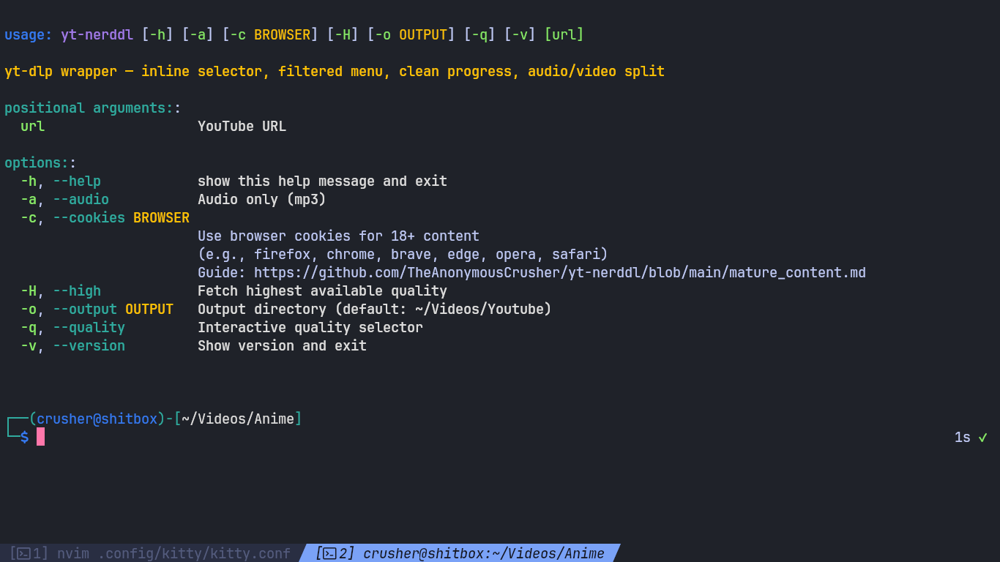
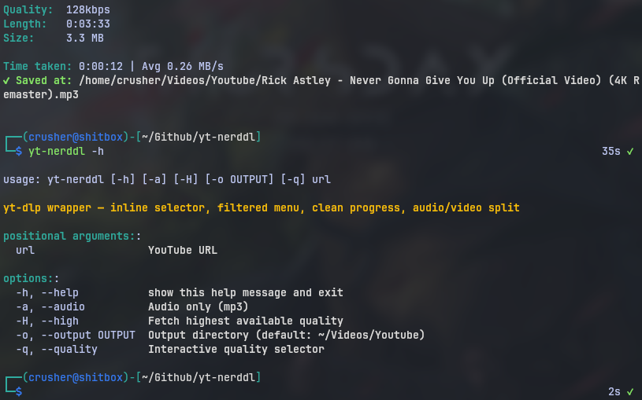
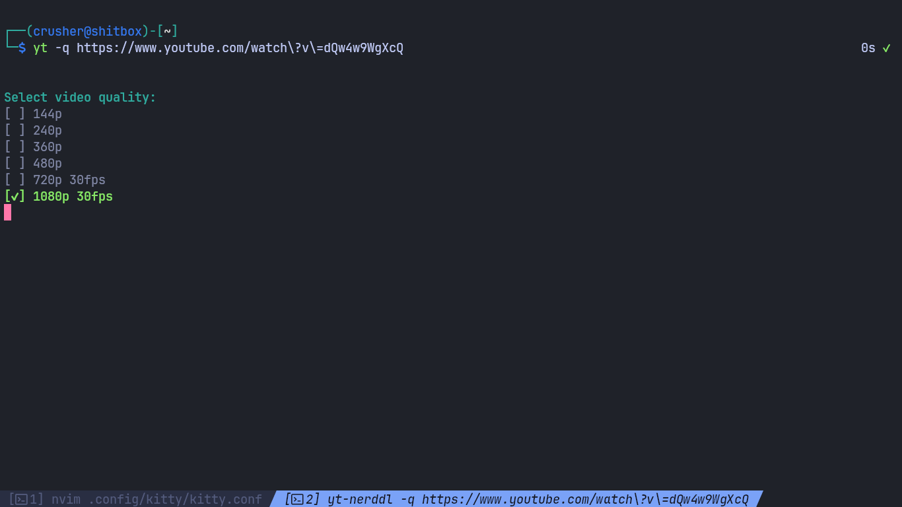
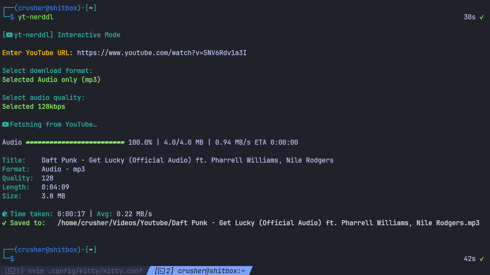

<div align="center">


**Check out the [website](https://theanonymouscrusher.github.io/yt-nerddl/) for easier reading ;)**


### A sleek YouTube downloader built on top of `yt-dlp`

Clean interactive selector • Deno-style progress bar • Minimal CLI UX

<br>


Inspired by [animepahe-cli](https://github.com/Danushka-Madushan/animepahe-cli)

</div>

---

## Preview

<div align="center">






</div>

> Tested only on **YouTube** & **YouTube Music**.  
> This is a `yt-dlp` wrapper, so other sites *might* work — but they are **untested** and **at your own risk**.  
>  
> `yt-dlp` can also download arbitrary hosted files (not just media). `yt-nerddl` will warn if a URL looks non-media/generic.

**Current Version:** `v2026.03.20`

---

# Features

✔ Audio & Video downloads <br>
✔ Interactive quality selector (arrow keys + numeric fallback) <br>
✔ Playlist detection <br>
✔ Deno-inspired progress bar <br>
✔ YouTube Music URL support <br>
✔ Automatic MP3 conversion <br>
✔ Cross-platform CLI menus <br>
✔ Cookie extraction for age-restricted videos <br>
✔ Built-in auto updater <br>
✔ Config + themes (`config.toml`, bundled themes) <br>
✔ Customizable progress bar width + glyphs (config overrides) <br>
✔ Resume + retries for shaky internet (`continuedl`, `retries`, `fragment_retries`) <br>
✔ Debug mode (`--debug`) <br>
✔ Skip prompts (`--yes`) <br>
✔ Clean minimal console output <br>
✔ Safe interrupt handling (`Ctrl+C`) <br>

---

# Installation

## Requirements

- **Python 3.11+**
- `yt-dlp`
- `ffmpeg` (recommended; required for merge/mp3 conversion)
- [Nerd Font](https://www.nerdfonts.com) (for icons)

## Install (Linux / macOS)

```bash
git clone [https://github.com/TheAnonymousCrusher/yt-nerddl.git](https://github.com/TheAnonymousCrusher/yt-nerddl.git)
cd yt-nerddl
chmod +x yt-nerddl.py
sudo mv yt-nerddl.py /usr/local/bin/yt-nerddl
````

**Run it:**

```bash
yt-nerddl [options] <url>
```

### [NOT RECOMMENDED] AUR (Arch Linux)

Older versions may appear in AUR.

```bash
yay -S yt-nerddl
```

Works with: `yay`, `paru`, `pikaur`.

## Windows Installation

1.  **Install Python**: Install Python 3.11+
2.  **Install FFmpeg**: Make sure `ffmpeg` is in your PATH.
3.  **Clone repository**:
  
    ```bash
    git clone [https://github.com/TheAnonymousCrusher/yt-nerddl.git](https://github.com/TheAnonymousCrusher/yt-nerddl.git)
    cd yt-nerddl
    ```
4. **Install dependencies**:
 
    ```bash
    pip install -r requirements.txt
    ```
5.  **Run**:
  
    ```bash
    python yt-nerddl.py [options] <url>
    ```

> *Use Windows Terminal + Nerd Font for proper icon rendering.*

-----

# Usage

**Basic command:**

```bash
yt-nerddl [options] <url>
```

### Options

| Option | Description |
| :--- | :--- |
| `-a, --audio` | Download audio only (MP3) |
| `--video` | Force video mode |
| `-q, --quality` | Interactive quality selector |
| `-H, --high` | Download highest available quality |
| `-c, --cookies <browser>` | Use browser cookies for age-restricted content |
| `--no-cookies` | Disable cookies even if enabled in config |
| `-o, --output <dir>` | Specify output directory |
| `-y, --yes` | Skip prompts/menus (use defaults/config) |
| `--debug` | Print detected domain, selected format, and yt-dlp options |
| `--theme <name>` | Theme override for this run |
| `--theme-preview` | List installed themes + preview |
| `--no-icons` | Disable icons for this run |
| `--no-colors` | Disable ANSI colors for this run |
| `--config <path>` | Use a custom config.toml path |
| `--init-config` | Create config + bundled themes and exit |
| `-U, --update` | Update script from GitHub |
| `-v, --version` | Show version |

-----

# Examples

**Download with quality selector:**

```bash
yt-nerddl -q [https://youtube.com/watch?v=xxxx](https://youtube.com/watch?v=xxxx)
```

**Skip prompts (use config defaults):**

```bash
yt-nerddl -q --yes [https://youtube.com/watch?v=xxxx](https://youtube.com/watch?v=xxxx)
```

**Download audio only:**

```bash
yt-nerddl -a [https://youtube.com/watch?v=xxxx](https://youtube.com/watch?v=xxxx)
```

**Update the script:**

```bash
yt-nerddl -U
```

-----

# Configuration

`yt-nerddl` auto-creates a config on first run.

**Default locations:**

  - **Linux/macOS:** `~/.config/yt-nerddl/config.toml`
  - **Windows:** `%APPDATA%\yt-nerddl\config.toml`

### Progress bar customization

You can override the bar glyphs in your `config.toml`:

```toml
[ui]
progress_bar_width = 30
progress_fill = "▰"
progress_empty = "▱"
```
-----

### Downloading Mature/Member only Content

Check out [mature_content.md](https://github.com/TheAnonymousCrusher/yt-nerddl/blob/main/mature_content.md) for details.

-----

### Output Directory

| OS | Path |
| :--- | :--- |
| **Linux / macOS** | `~/Videos/Youtube` |
| **Windows** | `%USERPROFILE%\Videos\Youtube` |

-----

# Contributing

Pull requests and issues are welcome. Keep the CLI clean, maintain readable colors, and preserve smooth UX.

# Acknowledgements

  - `yt-dlp` project
  - `animepahe-cli` for UX inspiration

<hr>

<div align="center">

**Made for people who like fast tools and clean terminals**

</div>
